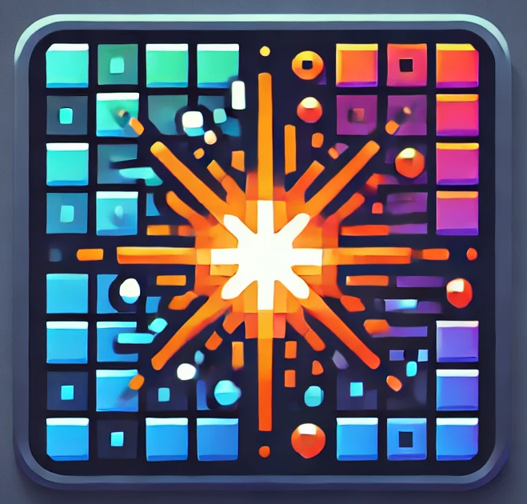

# Wall Spark Engine

[](LICENSE)


The Wall Spark Engine is a versatile pixel rendering and game engine designed for creating stunning animations or interactive games on wall-mounted pixel displays. It integrates effortlessly with [WLED](https://kno.wled.ge/) for seamless control and vibrant visual effects.
<br clear="left"/>

## Features

- Rendering on Console & WLED display (via UDP)
- Rendering/GameEngine with basics
- Config via config.json

## Roadmap

- **Milestone BlockClock** - Add the same functionality of BlockClock code of [BlockClock Repo](https://github.com/thespielplatz/tspi-blockclock)
- **Milestone Web UI** - t.b.d.
- **Milestone Example: Tetris Game with Socket.games** - t.b.d.

Too see the full roadmap or the milestones more in detail --> [Roadmap page](https://thespielplatz.notion.site/Wall-Spark-Roadmap-11a5896652c4805589b2e5b6cde2bb28) (*Single source of truth*).

## How to use

- install node lts

```bash
npm i wall-spark-engine
```

### Coding examples

```typescript
import { GameEngine, Config, Rainbow, Time } from 'wall-spark-engine'

console.info('Playground Example: Rainbow Clock')

const config = new Config()
const gameEngine = new GameEngine(config.config)
const rainbow = new Rainbow({
  x: 0,
  y: 0,
  width: config.config.width,
  height: config.config.height,
  speed: 0.25,
})
const time = new Time({
  x: 0,
  y: 0,
  centerOnWidth: config.config.width,
})

gameEngine.addGameObject(rainbow)
gameEngine.addGameObject(time)

gameEngine.start()
gameEngine.on(GameEngine.EVENT_STOPPED, () => {
  process.exit(0)
})
```

Have fun

## Dev Notes

Typescript guide: <https://www.totaltypescript.com/how-to-create-an-npm-package>

## Support

If you like this project, give it a star! If you love it, fork it and take it out for dinner. 🌟🍽️ And hey, why not [send some tip love?](https://thespielplatz.com/tip-jar)
